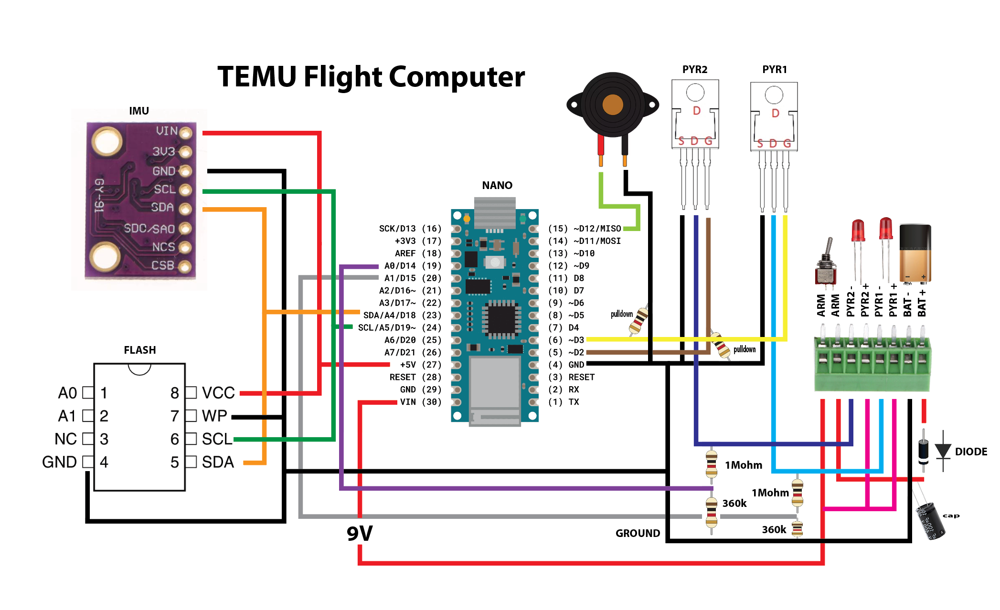

# TEMU Flight Computer HW Validation

  

> **TEMU Flight Computer** - An affordable, educational avionics system designed to teach undergraduates the fundamentals of flight computer hardware and software design.

  

The TEMU flight computer is a cheap, easy to produce avionics systems designed to each undergraduates the fundamentals of flight computer hardware and software design.

The flight computer consists of the following:
* Arduino Nano Clone (Old Bootloader)
* GY-91 Breakout Board
    * MPU6500 I2C Accelerometer and Gyroscope
    * BMP280 I2C Barometer
* AT24C256 I2C EEPROM
* Buzzer
* Two MOSFETs (PYR1 and PYR2)
* Terminal Block
* Various pull-up and pull-down resistors
* Capacitor between VIN and GND
